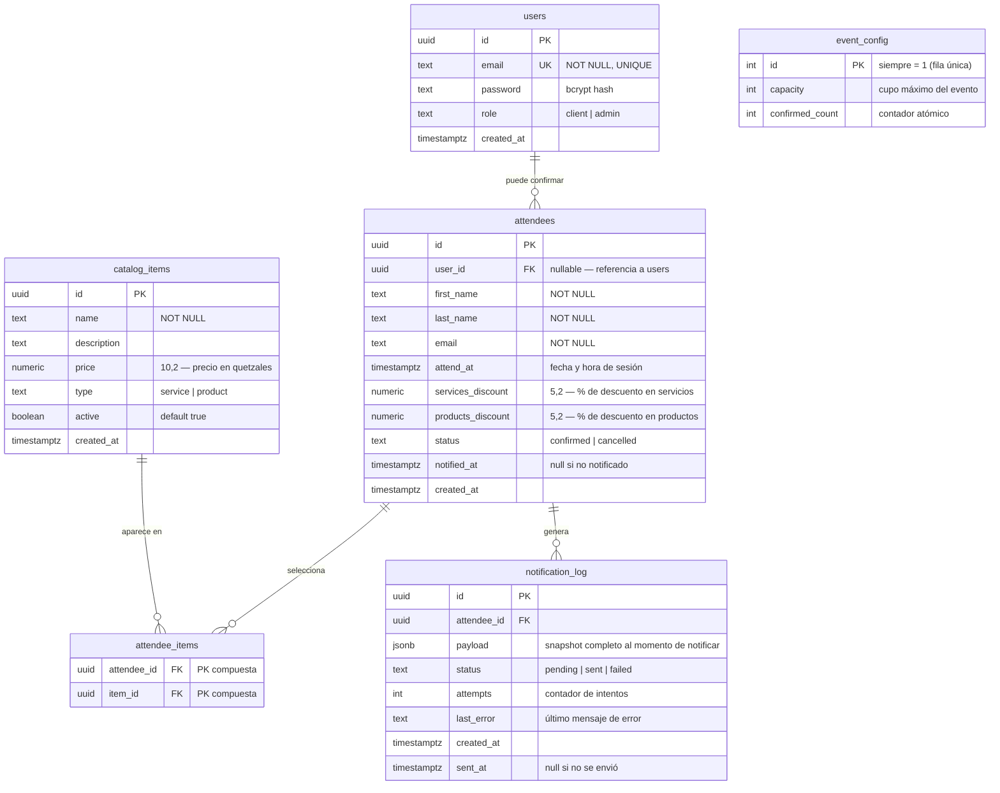

# PromoFest — Modelo de Base de Datos

## Diagrama Entidad-Relación



---

## Descripción de tablas

### `users`

Almacena las cuentas de usuario del sistema. Los clientes se registran con `role = 'client'`. Los administradores son creados por el seed automático en arranque usando las variables `ADMIN_EMAIL` y `ADMIN_PASSWORD`.

| Columna | Tipo | Descripción |
|---|---|---|
| `id` | UUID | Identificador único (gen_random_uuid) |
| `email` | TEXT | Email único; usado como identificador de login |
| `password` | TEXT | Hash bcrypt con salt factor 12 |
| `role` | TEXT | `'client'` (default) o `'admin'` |
| `created_at` | TIMESTAMPTZ | Fecha de creación |

---

### `catalog_items`

Catálogo de servicios y productos disponibles para seleccionar en la confirmación. Poblado mediante seed automático al arrancar si la tabla está vacía.

| Columna | Tipo | Descripción |
|---|---|---|
| `id` | UUID | Identificador único |
| `name` | TEXT | Nombre del ítem |
| `description` | TEXT | Descripción (opcional) |
| `price` | NUMERIC(10,2) | Precio en quetzales |
| `type` | TEXT | `'service'` o `'product'` |
| `active` | BOOLEAN | Si el ítem está disponible |
| `created_at` | TIMESTAMPTZ | Fecha de creación |

**Catálogo predeterminado (seed):**

| Nombre | Tipo | Precio |
|---|---|---|
| Consultoría Estratégica | service | Q.800.00 |
| Soporte Premium | service | Q.950.00 |
| Capacitación Corporativa | service | Q.1,200.00 |
| Auditoría de Procesos | service | Q.750.00 |
| Licencia Software Pro | product | Q.499.99 |
| Kit de Bienvenida | product | Q.89.99 |
| Módulo Reportes | product | Q.199.99 |
| Módulo Integraciones | product | Q.299.99 |
| Manual Técnico | product | Q.49.99 |
| Soporte Extendido Pack | product | Q.149.99 |

---

### `event_config`

Tabla de fila única que actúa como contador global del evento. El diseño de fila única (con `CHECK (id = 1)`) permite usar `SELECT ... FOR UPDATE` para serializar el acceso concurrente y prevenir overbooking.

| Columna | Tipo | Descripción |
|---|---|---|
| `id` | INT | Siempre = 1 |
| `capacity` | INT | Cupo máximo (configurable via `EVENT_CAPACITY`) |
| `confirmed_count` | INT | Número actual de confirmaciones |

**Estrategia de concurrencia:**

```sql
-- Dentro de la transacción de confirmación:
SELECT capacity, confirmed_count
FROM event_config
WHERE id = 1
FOR UPDATE;   -- bloquea la fila hasta el COMMIT
```

`FOR UPDATE` garantiza que solo una transacción a la vez puede leer y modificar el contador, eliminando condiciones de carrera en confirmaciones simultáneas.

---

### `attendees`

Registro de cada asistente confirmado. El campo `email` sirve como restricción de unicidad de negocio (un email = una confirmación), verificado por la capa de servicio.

| Columna | Tipo | Descripción |
|---|---|---|
| `id` | UUID | Identificador único |
| `user_id` | UUID | Referencia a `users.id` (nullable) |
| `first_name` | TEXT | Nombre del asistente |
| `last_name` | TEXT | Apellido del asistente |
| `email` | TEXT | Email de contacto |
| `attend_at` | TIMESTAMPTZ | Sesión elegida (fecha + hora) |
| `services_discount` | NUMERIC(5,2) | Descuento aplicado en servicios (%) |
| `products_discount` | NUMERIC(5,2) | Descuento aplicado en productos (%) |
| `status` | TEXT | `'confirmed'` o `'cancelled'` |
| `notified_at` | TIMESTAMPTZ | Fecha en que se notificó al equipo de ventas |
| `created_at` | TIMESTAMPTZ | Fecha de confirmación |

---

### `attendee_items`

Tabla de unión (many-to-many) entre `attendees` y `catalog_items`. Registra exactamente qué servicios y productos eligió cada asistente.

| Columna | Tipo | Descripción |
|---|---|---|
| `attendee_id` | UUID | FK a `attendees.id` (CASCADE DELETE) |
| `item_id` | UUID | FK a `catalog_items.id` |

La clave primaria es compuesta `(attendee_id, item_id)`, evitando duplicados.

---

### `notification_log`

Implementa el **patrón Outbox**. Cada intento de notificación al equipo de ventas se registra aquí antes de ser enviado. Si el envío falla, el registro permanece con `status = 'failed'` para facilitar reintentos manuales o automáticos.

| Columna | Tipo | Descripción |
|---|---|---|
| `id` | UUID | Identificador único |
| `attendee_id` | UUID | FK a `attendees.id` |
| `payload` | JSONB | Snapshot completo: nombre, email, ítems, descuentos |
| `status` | TEXT | `'pending'` → `'sent'` o `'failed'` |
| `attempts` | INT | Número de intentos de envío |
| `last_error` | TEXT | Mensaje del último error (si failed) |
| `created_at` | TIMESTAMPTZ | Fecha de creación del registro |
| `sent_at` | TIMESTAMPTZ | Fecha de envío exitoso |

**Ciclo de vida de una notificación:**

```
INSERT (status='pending')
    │
    ├─ Envío exitoso → UPDATE status='sent', sent_at=now()
    │                  UPDATE attendees SET notified_at=now()
    │
    └─ Envío fallido → UPDATE status='failed', last_error=msg
```

---

## Decisiones de diseño

### Fila única en `event_config`

En lugar de calcular `COUNT(*)` en `attendees` en cada confirmación (costoso bajo concurrencia), se mantiene un contador pre-calculado en `event_config`. La combinación con `FOR UPDATE` garantiza consistencia sin necesitar niveles de aislamiento más estrictos como `SERIALIZABLE`.

### Email como clave de negocio en `attendees`

Se verifica unicidad por email a nivel de servicio (antes de abrir la transacción) en lugar de usar una restricción `UNIQUE` en la BD. Esto permite retornar mensajes de error más descriptivos al usuario en lugar de errores genéricos de constraint.

### `payload` como JSONB en `notification_log`

El payload de la notificación almacena un snapshot de los datos en el momento de confirmar. Esto desacopla el log de cambios futuros en el catálogo o en los datos del asistente, garantizando que el historial refleje exactamente lo que se notificó.
