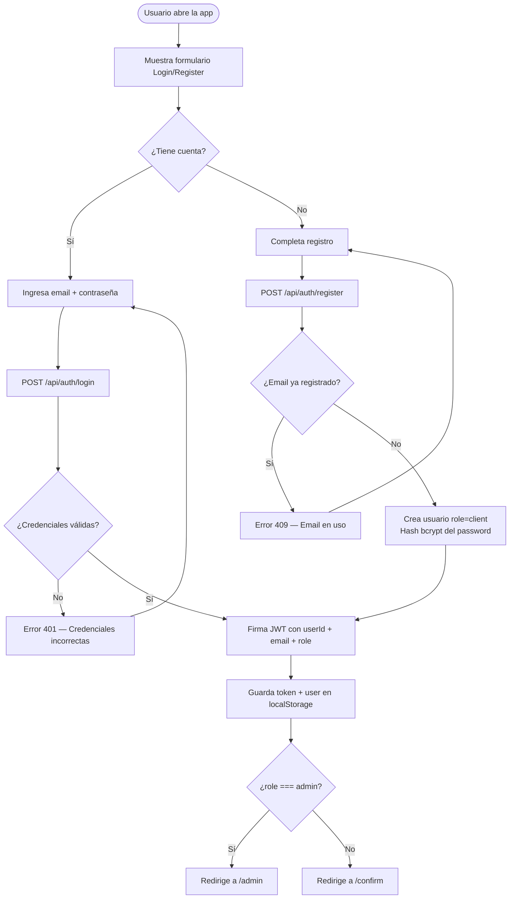
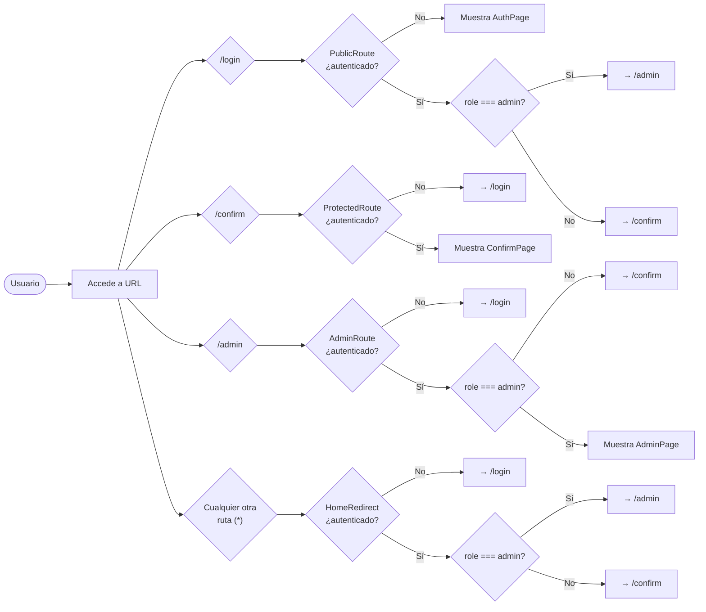
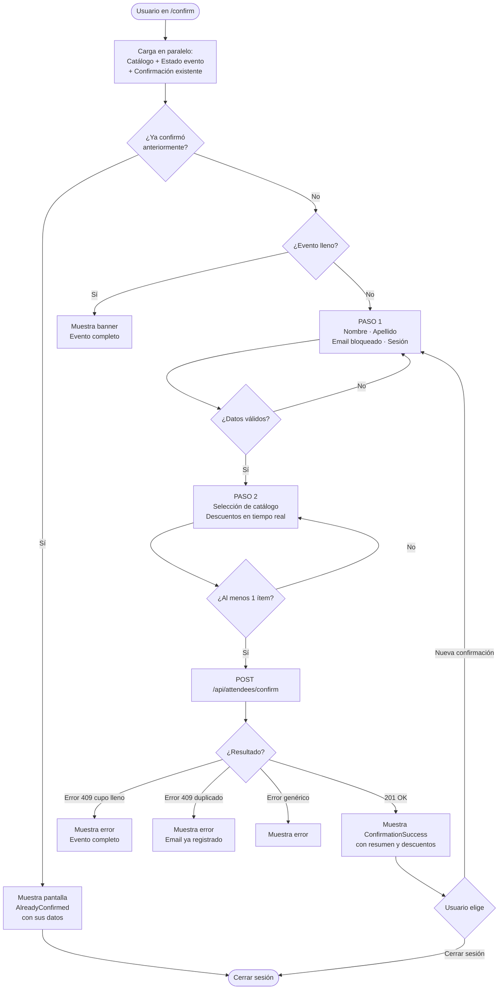
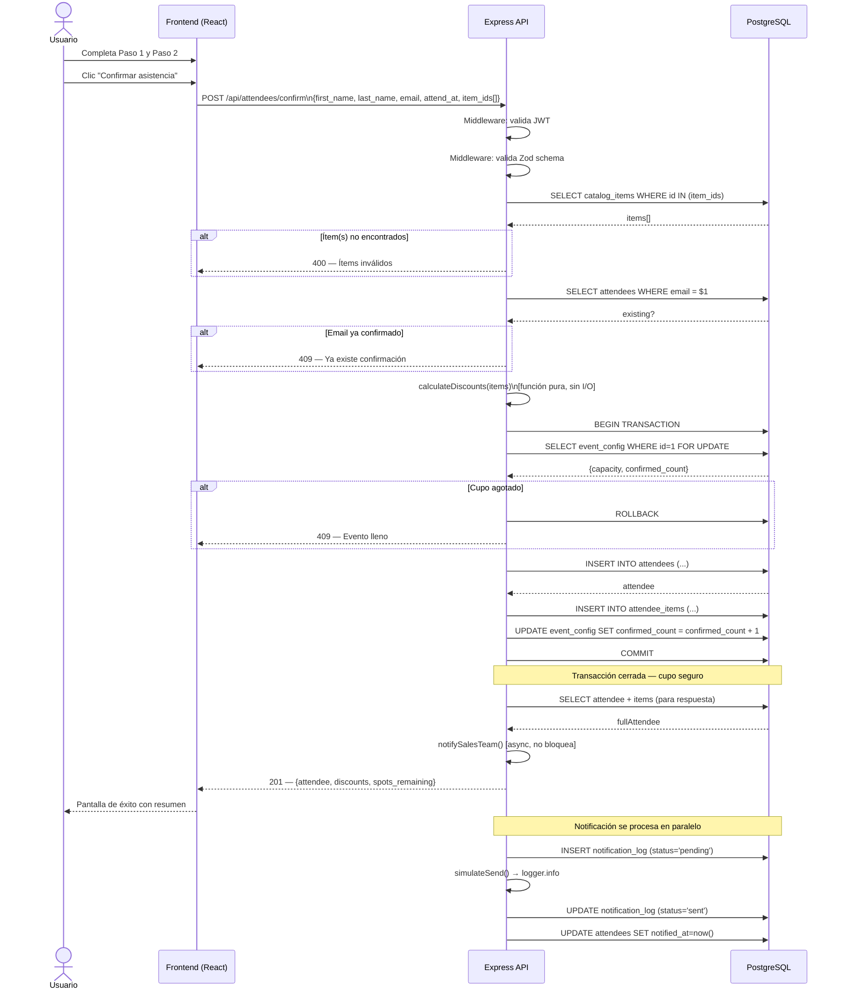
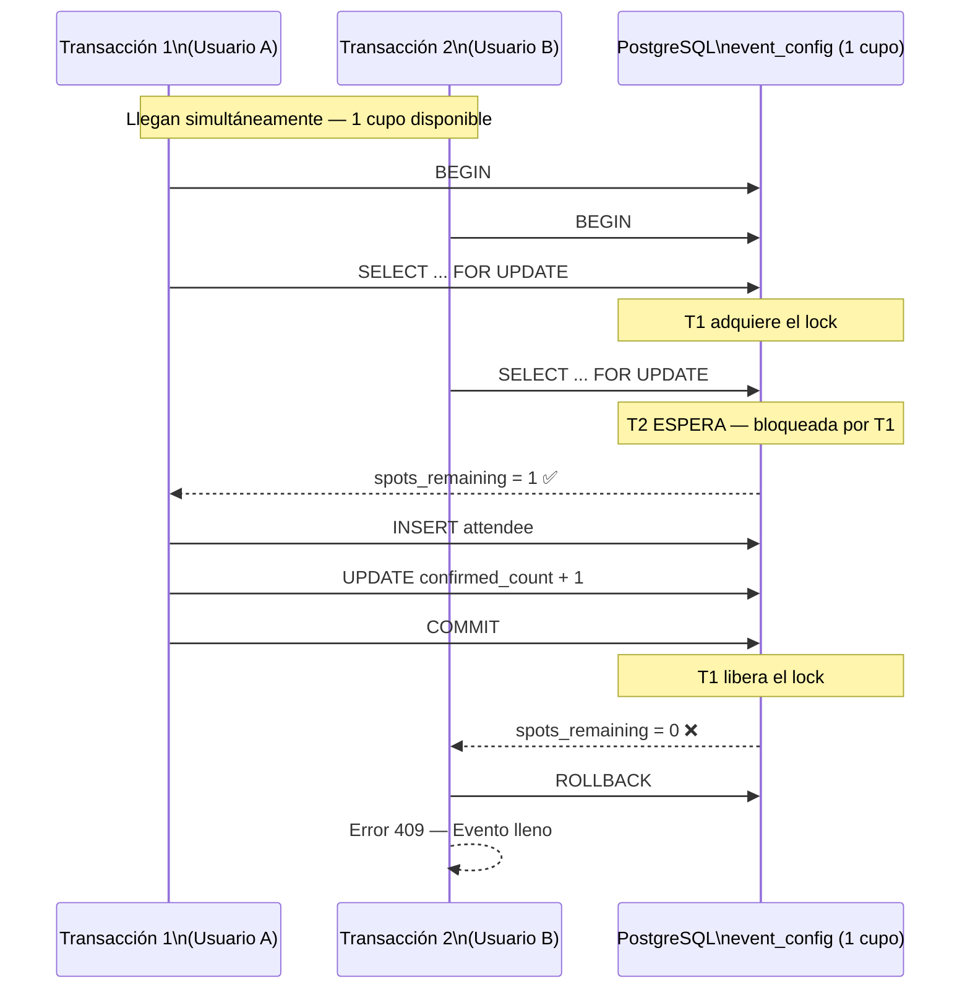
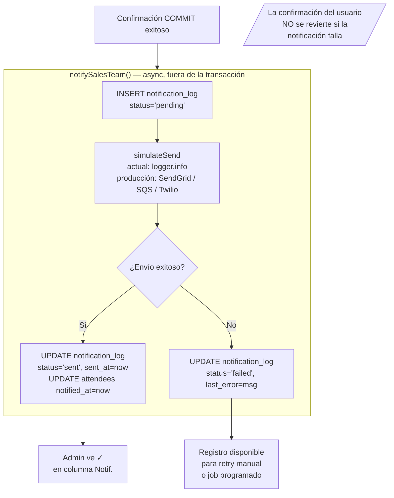
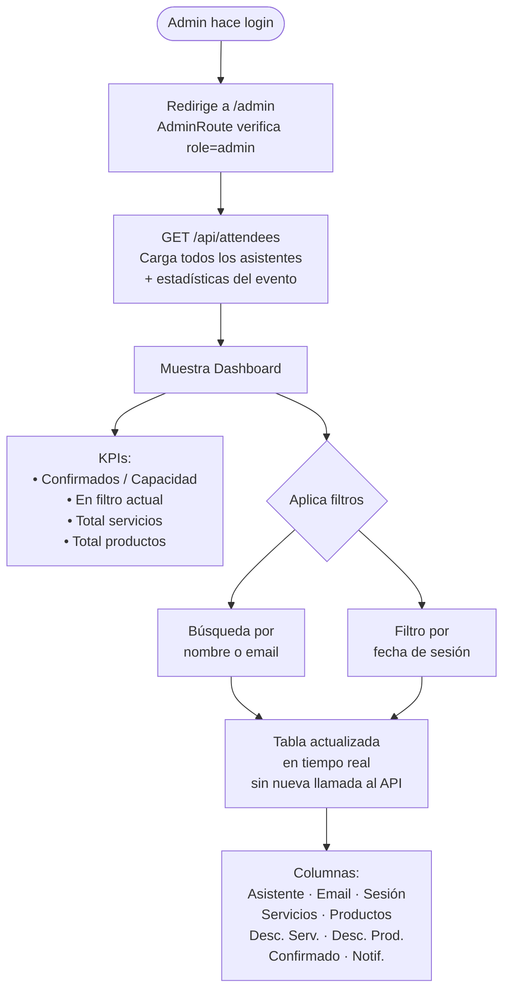

# PromoFest — Diagramas de Flujo

---

## 1. Flujo de autenticación

### 1.1 Registro de usuario

---

### 1.2 Rutas protegidas (guardas de ruta)

---

## 2. Flujo de confirmación de asistencia

### 2.1 Diagrama general del usuario

---

### 2.2 Secuencia de confirmación (backend)

---

## 3. Mecanismo anti-overbooking

---

## 4. Patrón Outbox — Notificaciones

---

## 5. Flujo del panel de ventas (Admin)

